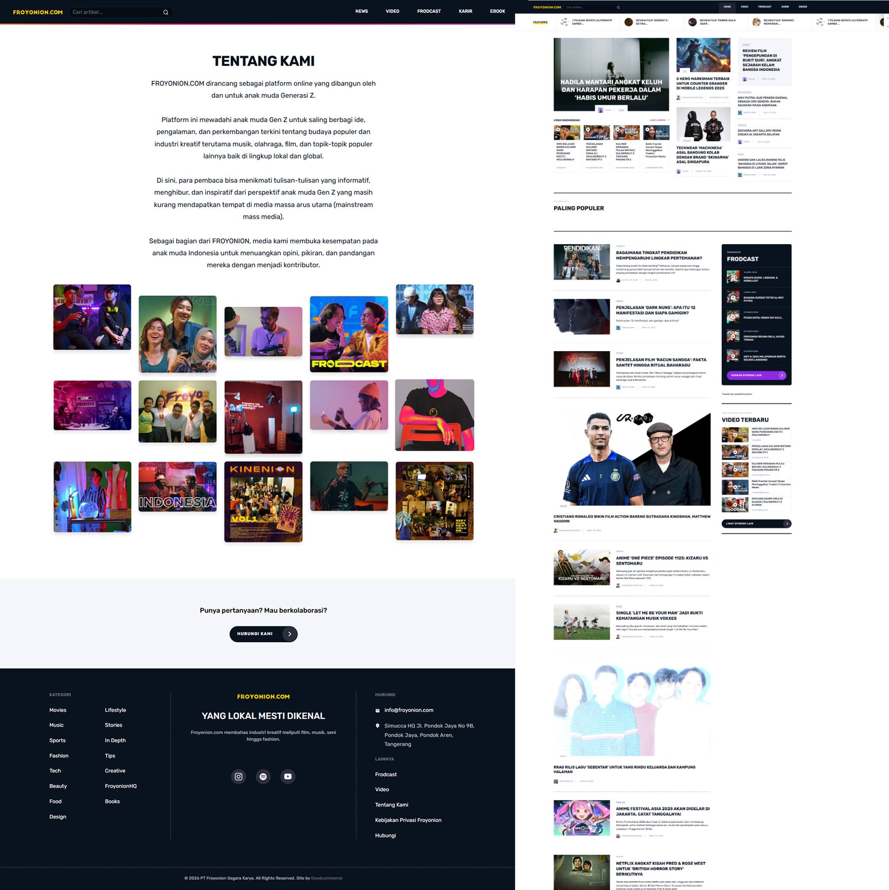
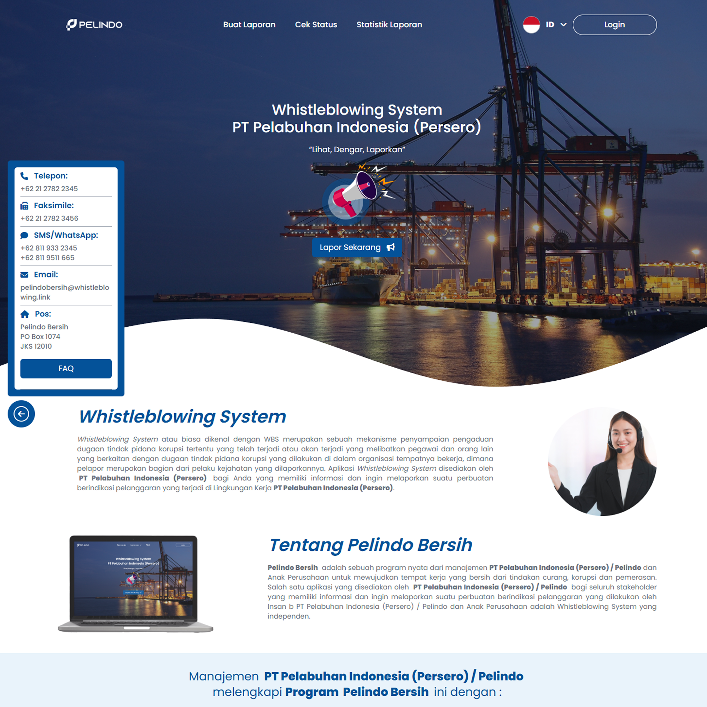

<div align="center">
  <h1>Hi there, I'm Hamada Ananta Burhanuddin! 👋</h1>
  <h3>Lead Developer | Backend Engineer | Fullstack Engineer</h3>
  
  <p>
    Building high-traffic transactional platforms and scalable distributed systems.
  </p>

  <a href="https://madacoda.dev" target="_blank">
    
  </a>
  <a href="https://www.linkedin.com/in/hamada-ananta-burhanuddin-294837193/" target="_blank">
    
  </a>
  <a href="mailto:me@madacoda.dev" target="_blank">
    
  </a>
</div>

<br/>

## 👨‍💻 About Me

```json
{
  "current_role": "Lead Developer @ Pixelogic Studio",
  "previous_role": "Architected distributed systems processing billions of records @ PT Permodalan Nasional Madani",
  "experience": "6+ years in Go, PHP, and Node.js ecosystems",
  "focus": [
    "System Architecture",
    "Performance Optimization",
    "Scalable Backend Services"
  ],
  "ask_me_about": ["Go", "Laravel", "Microservices", "Database Optimization"]
}
```

## 🛠️ Tech Stack & Tools

**Languages & Run-times:**  


**Frameworks:**  


**Databases:**  


**Infrastructure & Others:**  


## 🚀 Featured Projects

| Preview | Project & Description |
| :--- | :--- |
|  | 🛒 <a href="https://sepatucompass.com" target="_blank"><b>Sepatu Compass</b></a><br/><br/>Backend for webstore platform, enhancing online sales and customer engagement for a popular shoe brand. |
|  | 🎮 <a href="https://sekuya.io" target="_blank"><b>Sekuya</b></a><br/><br/>Digital platform for the Sekuya game aiming toward gamers, tech enthusiasts, and crypto. |
|  | 📰 <a href="https://www.froyonion.com" target="_blank"><b>Froyonion</b></a><br/><br/>News platform for a youth media company focusing on engaging articles and multimedia. |
|  | 🏢 <a href="https://pelindobersih.pelindo.co.id" target="_blank"><b>Pelindo Whistleblowing System</b></a><br/><br/>Corporate portal for environmental cleanliness and whistleblowing. |

